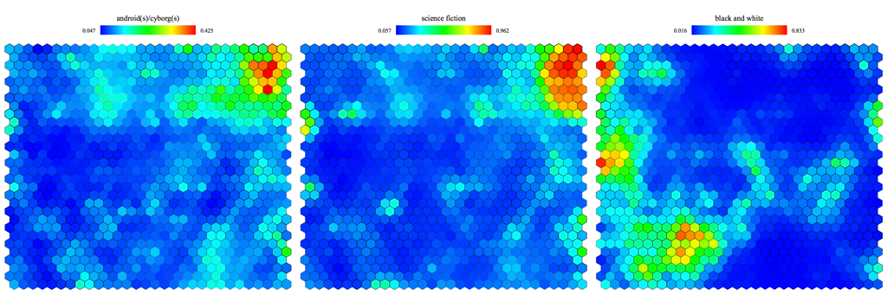

# SOM Renderer

This Package contains the code used to generate visualizations of Kohonen Self-Organizing Maps
for the MovieLens Dataset.

# References

- F. Maxwell Harper and Joseph A. Konstan. 2015. The MovieLens Datasets: History and Context. ACM Transactions on Interactive Intelligent Systems (TiiS) 5, 4, Article 19 (December 2015), 19 pages. DOI=http://dx.doi.org/10.1145/2827872
